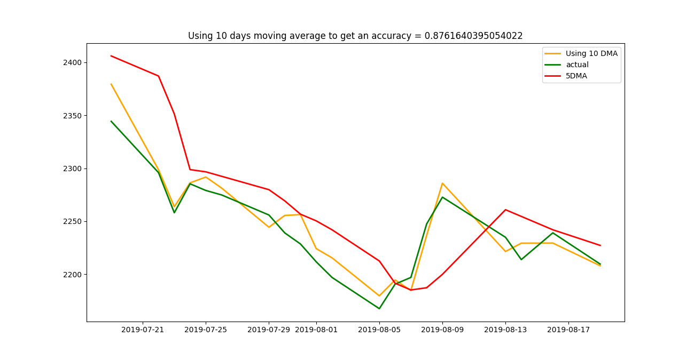

# Objective
HDFC bank\'s stock prices are considered for this project. The objective is to predict the next day opening price on the basis of open(the price at which the stock opened on a specific day), high(highest price the stock had on a specific day), low(lowest price the stock had on a specific day), close(the price at which the stock closed on a day), volume(number of transaction that occured for this company. i.e. HDFC bank on a specific day), 5DMA(5 days moving average of the opening price), 10DMA(10 days moving average of the opening price), 20DMA(20 days moving average of the opening price), 50DMA(50 days moving average of the opening price). A comparative study is also conducted to check which moving average contirbutes to better accuracy.

# Data

Data contains date, open, high, low, close, volume, 5 days moving average, 10 days moving average, 20 days moving average, 50 days moving average and the next day open.  
Last attribute will be used as label and all the remaining attributes will be used as features.

| date       | open | high | low  | close | volume  | 5 DMA | 10 DMA | 20 DMA | 50 DMA | next day open |
|------------|------|------|------|-------|---------|-------|--------|--------|--------|---------------|
| 2018-01-01 | 1873 | 1881 | 1851 |  1855 | 1645129 |  1870 |   1872 |   1866 |   1847 |          1859 |
| 2018-01-02 | 1859 | 1875 | 1859 |  1872 | 1194079 |  1870 |   1870 |   1869 |   1848 |          1875 |
| 2018-01-03 | 1875 | 1878 | 1851 |  1853 | 1132822 |  1869 |   1871 |   1873 |   1850 |          1853 |
| 2018-01-04 | 1853 | 1866 | 1853 |  1860 |  593444 |  1865 |   1868 |   1872 |   1852 |          1863 |
| 2018-01-05 | 1863 | 1868 | 1856 |  1864 |  717717 |  1865 |   1866 |   1872 |   1853 |          1865 |
| 2018-01-08 | 1865 | 1871 | 1858 |  1861 | 1142577 |  1860 |   1865 |   1872 |   1854 |          1862 |
| 2018-01-09 | 1862 | 1870 | 1855 |  1864 | 1326382 |  1863 |   1864 |   1869 |   1855 |          1865 |
| 2018-01-10 | 1865 | 1868 | 1857 |  1864 | 1153972 |  1864 |   1864 |   1868 |   1856 |          1864 |
| 2018-01-11 | 1864 | 1876 | 1856 |  1873 | 1014774 |  1864 |   1863 |   1867 |   1856 |          1873 |
| 2018-01-12 | 1873 | 1878 | 1860 |  1865 | 1084177 |  1866 |   1865 |   1867 |   1857 |          1870 |

Data collected from [yahoo finance](https://in.finance.yahoo.com/quote/HDFCBANK.NS/history?period1=1514745000&period2=1566153000&interval=1d&filter=history&frequency=1d).  
*Different moving average and next day open are programatically calculated. Above table is stored in [this](./DataSource/hdfc.csv) csv file*

# Visualisation
The visualisation is performed using Japnese Candle Stick Pattern and an addional line graph to plot the 5 days moving average. [This](./Visualisations/Explorative/OHLC_with_5SMA(total).png) plot demonstrates the entire data since 2015. It plot the OHLC and 5SMA. Since this graph is difficult to understand, [this](./Visualisations/Explorative/OHLC_with_5SMA(latest_100).png) can be seen (also mentioned below). This graph plots the OHLC price and 5SMA. Green color indicates a positive day and red color indicates a negative day.  
.png)

# Code
`python3 Analysis/LinearRegression.py`    
This file will develop the Linear Regression model and plot a graph containing the following plots. 
1. Predicted opening price for the next day by linear regression. 
2. Value of next day opening on the basis of 5DMA, 10DMA, 20DMA, 50DMA respectively. Generally this 5SMA is also used as a method to predict the next day open.  
3. Actual opening price for the next day. 
*The graph contains the respective labels for the plots.*

# Outcome
Linear Regression Model predicts the next day opening price with an accuracy of 88% when computed using 5 DMA.  
  
Other Accuracies computed using 5 DMA, 10DMA, 20DMA and 50DMA are as follows  
|Moving Average Used|Accuracy|
|-----|-----|
|5 days|88%|
|10 days|87%|
|20 days|85%|
|50 days|84%|

Graphs for othe rmoving averages are as follows. 
  
  
  
A collective graph of all the results is as follows.  
  
*This linear regression model has an accuracy of 88%*

# References
1. [Predicting stock market using machine learning](https://www.analyticsvidhya.com/blog/2018/10/predicting-stock-price-machine-learningnd-deep-learning-techniques-python/)
2. [Japnese Candlestick Pattern in python](https://matplotlib.org/api/finance_api.html)
3. [Linear Regression in sklearn](https://scikit-learn.org/stable/auto_examples/linear_model/plot_ols.html)